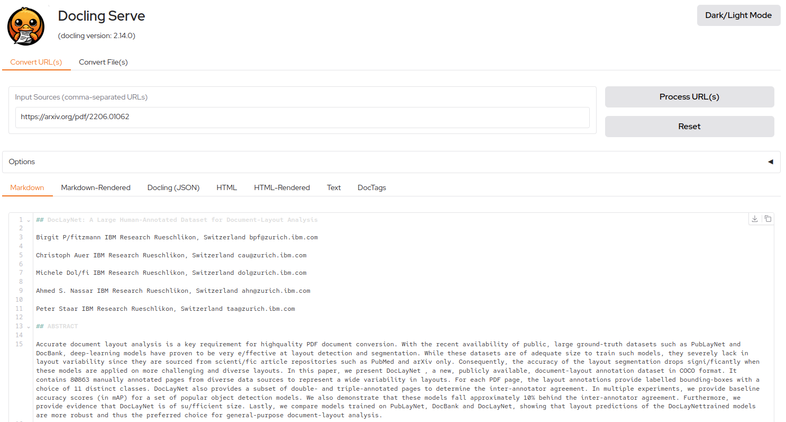

# Docling Serve

Running [Docling](https://github.com/docling-project/docling) as an API service.

## Getting started

Install the `docling-serve` package and run the server.

```bash
# Using the python package
pip install "docling-serve"
docling-serve run

# Using container images, e.g. with Podman
podman run -p 5001:5001 quay.io/docling-project/docling-serve
```

The server is available at
- API http://127.0.0.1:5001
- API documentation http://127.0.0.1:5001/docs
  

Try it out with a simple conversion:

```bash
curl -X 'POST' \
  'http://localhost:5001/v1alpha/convert/source' \
  -H 'accept: application/json' \
  -H 'Content-Type: application/json' \
  -d '{
    "http_sources": [{"url": "https://arxiv.org/pdf/2501.17887"}]
  }'
```

### Container images

Available container images:

| Name | Description | Arch | Size |
| -----|-------------|------|------|
| [`ghcr.io/docling-project/docling-serve`](https://github.com/docling-project/docling-serve/pkgs/container/docling-serve) <br /> [`quay.io/docling-project/docling-serve`](https://quay.io/repository/docling-project/docling-serve) | Simple image for Docling Serve, installing all packages from the official pypi.org index. | `linux/amd64`, `linux/arm64` | 3.6 GB |
| [`ghcr.io/docling-project/docling-serve-cpu`](https://github.com/docling-project/docling-serve/pkgs/container/docling-serve-cpu) <br /> [`quay.io/docling-project/docling-serve-cpu`](https://quay.io/repository/docling-project/docling-serve-cpu) | Cpu-only image which installs `torch` from the pytorch cpu index. | `linux/amd64`, `linux/arm64` | 3.6 GB |
| [`ghcr.io/docling-project/docling-serve-cu124`](https://github.com/docling-project/docling-serve/pkgs/container/docling-serve-cu124) <br /> [`quay.io/docling-project/docling-serve-cu124`](https://quay.io/repository/docling-project/docling-serve-cu124) | Cuda 12.4 image which installs `torch` from the pytorch cu124 index. | `linux/amd64` | 8.7 GB |

Coming soon: `docling-serve-slim` images will reduce the size by skipping the model weights download.

### Demonstration UI

```bash
# Install the Python package with the extra dependencies
pip install "docling-serve[ui]"
docling-serve run --enable-ui

# Run the container image with the extra env parameters
podman run -p 5001:5001 -e DOCLING_SERVE_ENABLE_UI=true quay.io/docling-project/docling-serve
```

An easy to use UI is available at the `/ui` endpoint.




## Documentation and advance usages

Visit the [Docling Serve documentation](./docs/README.md) for learning how to [configure the webserver](./docs/configuration.md), use all the [runtime options](./docs/usage.md) of the API and [deployment examples](./docs/deployment.md).

## Get help and support

Please feel free to connect with us using the [discussion section](https://github.com/docling-project/docling/discussions).

## Contributing

Please read [Contributing to Docling Serve](https://github.com/docling-project/docling-serve/blob/main/CONTRIBUTING.md) for details.

## References

If you use Docling in your projects, please consider citing the following:

```bib
@techreport{Docling,
  author = {Docling Contributors},
  month = {1},
  title = {Docling: An Efficient Open-Source Toolkit for AI-driven Document Conversion},
  url = {https://arxiv.org/abs/2501.17887},
  eprint = {2501.17887},
  doi = {10.48550/arXiv.2501.17887},
  version = {2.0.0},
  year = {2025}
}
```

## License

The Docling Serve codebase is under MIT license.

## IBM ❤️ Open Source AI

Docling has been brought to you by IBM.
