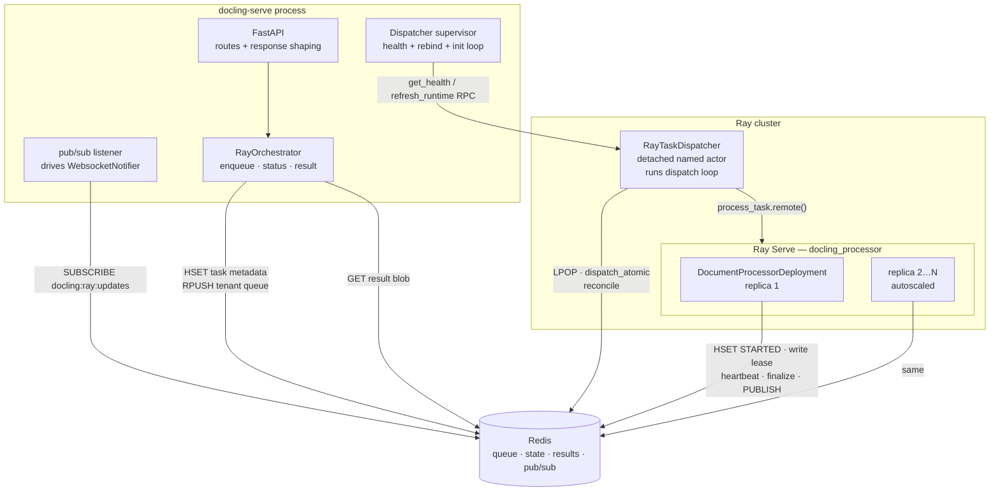
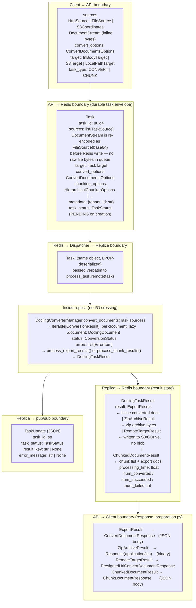
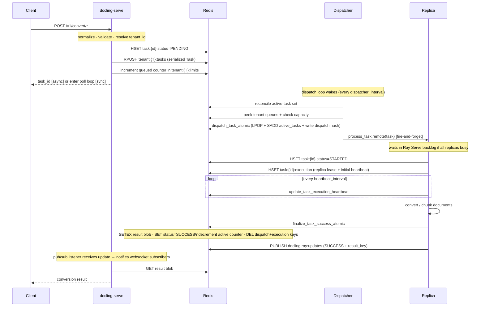
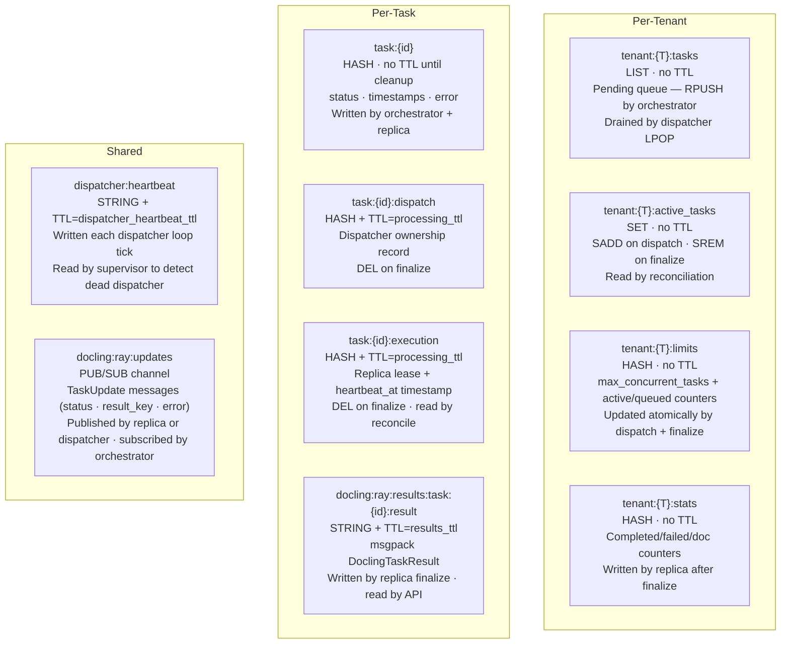
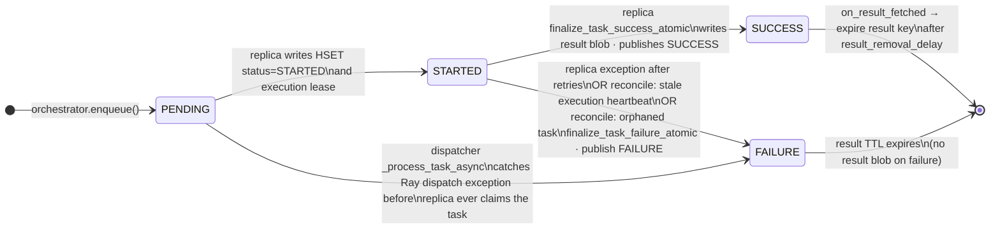
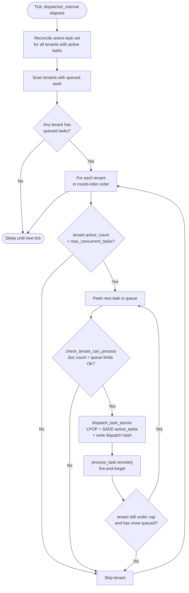
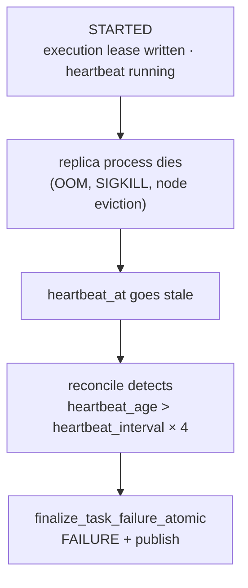
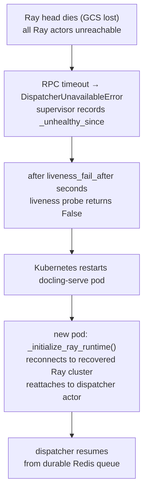
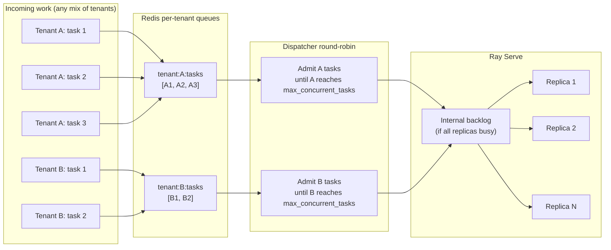

# Ray Orchestrator Architecture

Scope: `docling-serve` API layer through `docling-jobkit` Ray path — from an incoming conversion request to a durable result in Redis.

Each diagram has a single intent. Read them in order to build up the full picture.

---

## 1. Component Topology

What processes/actors exist, which host boundary they belong to, and what kind of communication connects them.

Key ownership boundaries:
- **`docling-serve`** is the only component that accepts HTTP and returns results to clients.
- **`RayTaskDispatcher`** is a detached Ray actor — it survives API pod restarts.
- **`DocumentProcessorDeployment`** replicas are managed by Ray Serve autoscaling.
- **Redis** is the system of record for all task state. Every other component is stateless with respect to task ownership.

---

## 2. Data Types Across Boundaries

What types flow between components at each handoff — from raw HTTP input to the final response body.

Notes:
- `DocumentStream` (in-memory bytes from a caller that passed raw file content) is converted to `FileSource` with a base64-encoded body before the `Task` is pushed to Redis. The queue never contains raw file handles.
- `ConversionResult` is a docling-internal type that never crosses a network or Redis boundary. It is the lazy per-document output of the docling converter, consumed immediately inside the replica by `process_export_results()` or `process_chunk_results()` to produce `DoclingTaskResult`.
- `RedisTaskMetadata` (stored in `task:{id}` HASH) is a separate, leaner structure written in parallel with the queue push — it holds status, timestamps, tenant_id, and task_size for fast status lookups and reconciliation, without the full payload.
- The `result` field in `DoclingTaskResult` is a discriminated union. `response_preparation.py` switches on the concrete type to pick the correct HTTP response shape.
- For `RemoteTargetResult` (S3/GDrive target), the result blob contains no document content — the replica has already pushed the output to the remote target, and the HTTP response is just a delivery confirmation.

---

## 3. Happy-Path Request Flow

One request from HTTP call to result retrieval, no failures.

Notes:
- The replica's Serve slot (including its full CPU and GPU allocation) is held from `process_task.remote()` dispatch all the way through `finalize_task_success_atomic` — the complete wall-clock duration of the conversion. A single replica processes one task at a time.
- `max_ongoing_requests=1` (the default) is a **thread-safety requirement**, not a conservative tuning choice: `DoclingConverterManager` is not safe to call concurrently within one replica. Ray Serve autoscaling (`min_actors` / `max_actors`) is the primary throughput lever — each additional replica adds one parallel conversion slot.

---

## 4. Redis Key Space

Keys are grouped by scope. Each entry lists key pattern, data type, TTL policy, and who reads/writes it.

State interpretation:
- A task has only `tenant:{T}:tasks` entry → queued, not yet admitted.
- A task has `task:{id}:dispatch` → dispatcher admitted it, submitted to Ray Serve (status still PENDING until replica starts).
- A task has `task:{id}:execution` → a replica has claimed it and is heartbeating.
- `task:{id}:execution.heartbeat_at` going stale → replica is dead (see reconciliation).

---

## 5. Task State Machine

All states and transitions, happy path and failure paths combined.

Notes:
- `task:{id}` status stays `PENDING` for the entire window from enqueue through dispatch hash write — `STARTED` is only set once a replica actually begins work.
- The `finalize_task_*_atomic` operations are idempotent and compare-and-swap: if a replica succeeds just as the dispatcher is marking the same task as failed, the replica's SUCCESS wins and is preserved.

---

## 6. Dispatcher Admission Round

What the dispatcher executes on each `dispatcher_interval` tick.

---

## 7. Failure Modes

### 7a. Conversion fails inside replica

The replica's `_process_convert_with_retry` raises after `max_task_retries` attempts.

- The exception propagates to `_process_task_async` in the dispatcher.
- `finalize_task_failure_atomic` is called: sets `task:{id}` status=FAILURE, decrements active counter, deletes dispatch + execution keys.
- FAILURE is published on pub/sub.
- No result blob is written; client polling reads status=FAILURE + error message.

### 7b. Replica OOM or hard crash

The Ray Serve replica process is killed or exits unexpectedly mid-task.

- Execution heartbeat stops updating `task:{id}:execution.heartbeat_at`.
- Dispatcher reconciliation (runs every round) detects `heartbeat_age > heartbeat_interval × 4`.
- `_fail_reconciled_task` → `finalize_task_failure_atomic` → FAILURE + publish.
- Ray Serve autoscaler starts a replacement replica.

### 7c. Dispatcher actor dies or is restarted

The `RayTaskDispatcher` detached actor crashes.

- In-flight `_process_task_async` fire-and-forget coroutines are lost with the actor.
- Their tasks remain in `active_tasks` SET with no further activity.
- The supervisor in `docling-serve` detects the next health-check RPC failure; clears `self.dispatcher`.
- `_bind_dispatcher()` with `get_if_exists=True` + `max_restarts` triggers automatic Ray restart.
- On restart the dispatcher immediately runs `_reconcile_active_tasks`:
  - STARTED tasks with a stale execution heartbeat → FAILURE.
  - Dispatched-but-not-yet-STARTED tasks (no execution lease written yet) → left unresolved (conservative: they may still be in Ray Serve's backlog).
- Tasks still in `tenant:{T}:tasks` (never popped) are dispatched normally on the next round.

### 7d. Ray head unavailable (GCS lost)

The Ray GCS node dies, taking all Ray actors with it.

- RPCs to the dispatcher start timing out (`dispatcher_rpc_timeout`).
- The supervisor catches `DispatcherUnavailableError` and sets `_unhealthy_since`.
- After `liveness_fail_after` seconds of continuous failure, `is_liveness_healthy()` returns False → Kubernetes restarts the `docling-serve` pod.
- **Redis survives** — all task metadata and queued tasks are intact.
- New `docling-serve` pod calls `_initialize_ray_runtime()`, reconnects to a recovered Ray cluster, reattaches to the dispatcher actor, and dispatch resumes.

### 7e. Dispatcher RPC timeout (transient)

An isolated RPC call to the dispatcher times out but the actor is still alive.

- Supervisor clears `self.dispatcher` reference and retries in 1 second.
- New tasks written to Redis during the gap are safe — queue is durable.
- No tasks are lost; dispatch resumes automatically.

### 7f. Redis unavailable

All components that touch Redis will surface errors, but at different layers:

- `orchestrator.enqueue()` fails → HTTP 503 to client (no task created).
- Dispatcher reconcile/dispatch operations fail → exception logged, loop sleeps and retries.
- Replica heartbeat/finalize operations fail → task may be left stuck in STARTED; reconciliation will eventually clean it up once Redis recovers.

---

## 8. Multi-Tenant Fairness and Autoscaling

Notes:
- Dispatcher enforces **per-tenant** `max_concurrent_tasks` before submitting to Ray Serve; this is the primary backpressure mechanism.
- In a single round, a tenant can receive multiple dispatches if it still has capacity after its first task is submitted.
- Autoscaling of replicas is managed by Ray Serve (`min_actors` / `max_actors` / `target_requests_per_replica`). The dispatcher does not control replica count.
- Queue position returned by the API reflects the tenant queue depth, not the Ray Serve backlog — it is approximate.

---

## Source Pointers

| Component | File |
|-----------|------|
| FastAPI routes, lifespan, enqueue path | `docling_serve/app.py` |
| Orchestrator: enqueue, supervisor, pub/sub | `docling_jobkit/orchestrators/ray/orchestrator.py` |
| Dispatcher actor: dispatch loop, reconcile | `docling_jobkit/orchestrators/ray/dispatcher.py` |
| Replica: process_task, heartbeat, finalize | `docling_jobkit/orchestrators/ray/serve_deployment.py` |
| Redis atomics, key layout, pub/sub | `docling_jobkit/orchestrators/ray/redis_helper.py` |
| Config knobs | `docling_jobkit/orchestrators/ray/config.py` |
